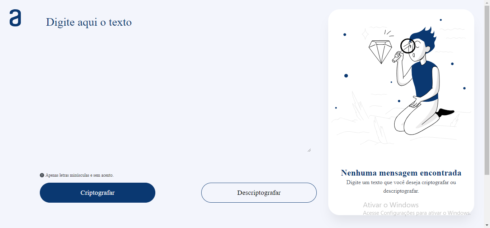

# Sobre o Projeto

Esse é o primeiro projeto da jornada de formação do programa [**ONE**](https://www.oracle.com/br/education/oracle-next-education/).

# Decodificador de texto

Esta é uma aplicação que criptografa textos, assim você poderá trocar mensagens secretas com outras pessoas que saibam o segredo da criptografia utilizada.
É possível converter uma palavra para a versão criptografada e também retornar uma palavra criptografada para a versão original.

Por exemplo:
"gato" => "gaitober"
gaitober" => "gato"

## Veja:
Assista a aplicação em execusão clicando na imagem a seguir:

# Tecnologias

`Javascript` 

# Para ultilizar na sua máquina

- Faça download do repositório para o seu computador;
- Execute o arquivo index.html no seu navegador;

# Acessando o PDV publicado:

- É só clicar [aqui](https://trizces.github.io/decodificador-de-texto/)!

## Criadores do desafio:

[Genesys del Valle Merchan](https://www.linkedin.com/in/genesysrondon914762182/) e 
[Weslley Bastos](https://www.linkedin.com/in/wessbastos/)

## Modelo do figma:
[Figma](https://www.figma.com/file/tvFEYhVfZTjdJ5P24RGV21/Alura-Challenge---Desafio-1---L%C3%B3gica?node-id=16%3A802)

#### tags: `challengeonedecodificador5` `one` `alura` `oracle` `JavaScript` `desafio` `html` `css` `front-end` `logicadeprogramacao`
